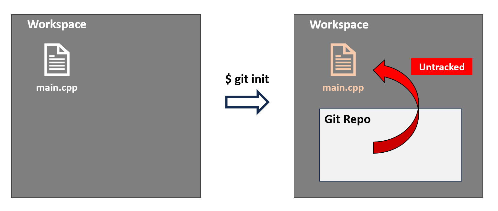
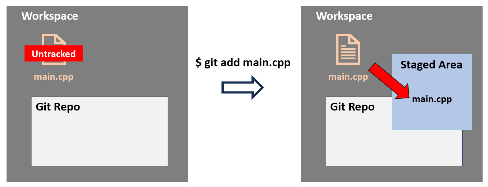
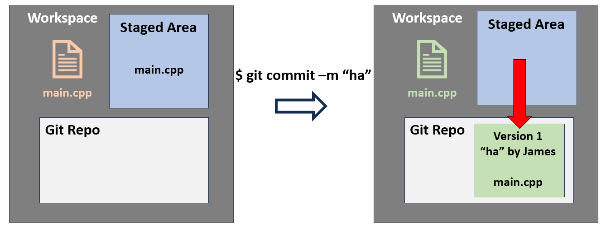
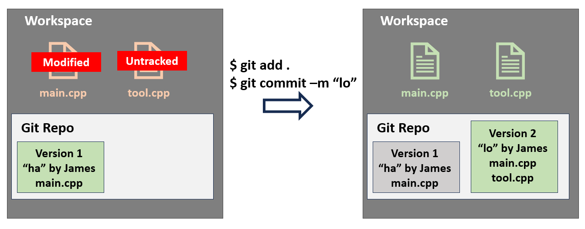
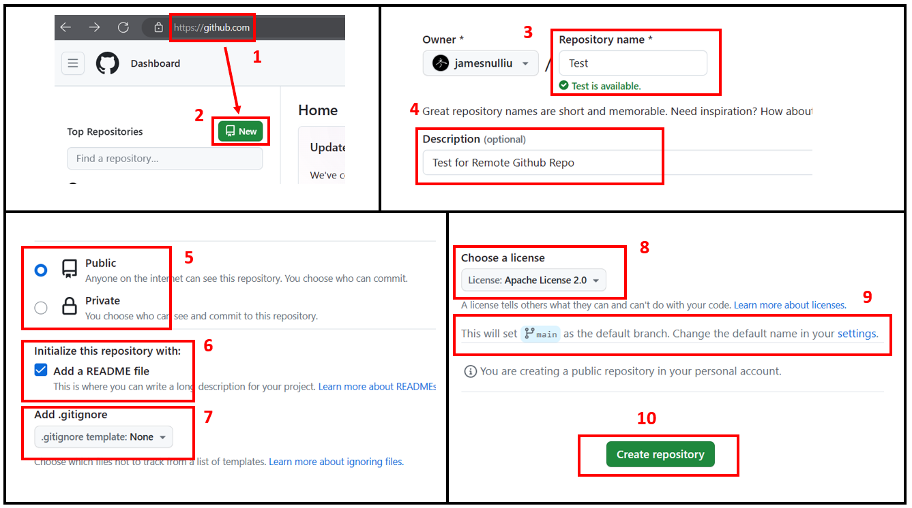
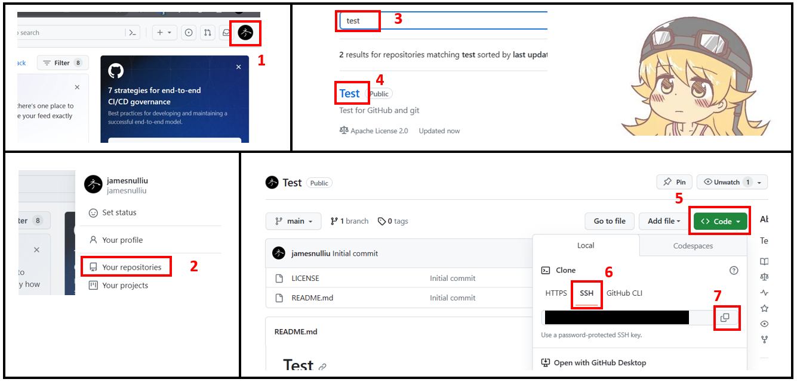

## 1. 安装 Git

请参考文章: [安装 Git](Install-Git_zh.md) .

> 📌 **注意**  
> 如果你是 Windows 用户, 由于这个 [Issue](https://github.com/gitextensions/gitextensions/issues/5073) 尚未被解决, 我们建议使用 Git Bash (而非 PowerShell) 执行 Git 命令.

## 2. 配置 Git

在进行版本管理前需要向 Git 提供 user 的信息; 具体来说, 你需要设置 (当前工作区或全局的) :

- `user.name`
- `user.email`

> 💬 你的所有 commit 记录中都会包含上述信息.

为了简化流程, 我们直接设置全局的 user 信息.

打开终端, 输入以下两条指令分别设置 `user.name` 和 `user.email` (请将 `<...>` 替换为合适内容):

```bash
git config --global user.name "<YourName>"
git config --global user.email "<YourEmail>"
```

设置完成后, 除非重装了 Git 或想主动更改信息, 否则不用再次设置.

输入以下命令将 Git 的默认分支名从 `master` 改为 `main`:

```bash
git config --global init.defaultBranch main
```

更改后, 当你在一个新的工作区内执行 `git init` 时, Git 会自动将默认分支名设为 `main`.

## 3. 本地 Git 储存库
### 3.1. 在工作区内创建本地 Git 储存库

> 💬 工作区一般指一个项目的根目录, 或者说项目文件夹.

你可以为任意一个工作区创建一个本地 Git 储存库, 进而对储存库中的文件进行版本控制.

打开终端 cd 到工作区路径 (或者在工作区文件夹内的空白处右键, 选择打开终端), 输入以下命令可以将当前工作区创建为一个本地 Git 储存库:

```bash
git init
```



<p align="center">
Figure 1. git init 做了什么
</p>

在 Fig.1 中, 由于我们刚刚创建了一个 Git 储存库, 但还没告诉储存库: "**你应该去跟踪工作区里的 `main.cpp` 的改动.**"; 因此当前 `main.cpp` 这个文件处于 `Untracked` 的状态."

通过以下命令可以查看当前工作区的状态:

```bash
git status
```

### 3.2. 将改动 commit 到本地 Git 储存库

在 [3.1. 在工作区内创建本地 Git 储存库](#31-在工作区内创建本地-git-储存库) 中, 我们创建了一个本地 Git 储存库, 并且当前储存库中的 `main.cpp` 处于 `Untracked` 状态.

参考 Fig.2, 可以利用以下命令将工作区内的改动 `add` 到缓存区 (`add` 后, 改动还没被正式记录, 只是被缓存了):

```
git add <FilePath>
```



<p align="center">
Figure 2. git add 做了什么
</p>

参考 Fig.3, 接着利用以下命令可以正式将改动 `commit` 到本地 Git 储存库 (将 `<Message>` 替换为合适内容, 用于描述这次 `commit` 的内容):

```bash
git commit -m "<Message>"
```




<p align="center">
Figure 3. git commit 做了什么
</p>

`commit` 完成后, 当前的**工作区内的所有内容**将成为一个**版本**, 记录在本地 Git 储存库中.

> 💬 如果只执行 `git commit`, Git 会打开一个文本编辑器 (默认为 Vim) 让你描写详细的 `commit` 内容.
  
接着我们修改文件 `main.cpp` 中的内容 (比如写几行代码), 同时在工作区内新建一个文件 `tool.cpp`.

执行命令 `git status`, 终端会提示 `main.cpp` 处于 `Modified` 的状态, 而 `tool.cpp` 处于 `Untracked` 的状态.


参考 Fig.4, 输入以下两条命令将**当前路径下**的**所有的更改**都 `add` 进缓存区并 `commit` 为一个新版本:

```bash
git add .
git commit -m "<Message>"
```



<p align="center">
Figure 4. 创建第二个版本
</p>

Fig.4 中的 Version 2 是当前项目的最新版本.

> 💬 之后的开发过程中如果出现问题, 可以进行**版本回退**, **版本比较**等操作.

## 4. 远程储存库

很多时候, 我们需要在不同的电脑上部署某个项目进行多人协同开发. 因此出现 "将本地 Git 储存库同步到一个远程储存库 (例如 GitHub)" 的想法.


### 4.1. 生成 SSH 密钥并连接 GitHub

参考文章: [利用 SSH 密钥链接 GitHub](Connect-to-GitHub-with-SSH-Keys_zh.md) .

### 4.2. 创建一个 GitHub 储存库

根据 Fig.5, 我们可以在 GitHub 上创建一个新的远程 Git 储存库:
1. 输入 GitHub 的网址进入首页并登录.
2. 点击左侧的 `New` 按钮创建一个新储存库.
3. 给储存库取个名字.
4. 写一个对于当前储存库的简短介绍.
5. 选择是否公开储存库, 如果不公开, 除了你以外别人都无法看到你的储存库.
6. 选择是否添加一个 README 文件, 相当于对自己储存库的详细介绍文件. README 文件会展示在储存库的首页.
7. 选择是否添加 .gitignore 文件; 目的是强制地不跟踪项目中的某些文件.
8. 选择一个 licence, 也就是告诉别人可以怎么使用你的代码: 能不能进行商业行为, 能不能直接复制你的代码不注明你是作者之类的.
9. GitHub 上目前把默认分支名从 master 改成 main 了, 这是为了回应 Black Lives Matter 运动.
10. 上面 9 步设置完后, 点右下角 `Create repository`, 你就能成功创建一个远程 GitHub 储存库, 并且跳到储存库的首页了&#x1F601;.




<p align="center">
Figure 5. 如何创建一个远程 GitHub 储存库
</p>

> 📌 **注意**: GitHub 上创建的储存库默认分支名为 `main` (而非 `master`).

根据 Fig.6, 打开刚刚创建的储存库, 获取远程储存库的 SSH 地址.



<p align="center">
Figure 6. 获取远程储存库的 SSH 地址
</p>

### 4.3. 关联本地储存库与远程储存库

在 [3. 本地 Git 储存库](#3-本地-git-储存库) 中, 我们已经创建了一个本地 Git 储存库, 并且提交了一些更改; 同时在 [4.2. 创建一个 GitHub 储存库](#42-创建一个-github-储存库) 中, 我们在 GitHub 上创建了一个新的远程 Git 储存库, 并获取了远程储存库的 SSH 地址.

接下来我们将关联这个这两个储存库.

打开终端, 将终端路径切换到本地储存库, 通过以下命令将远程储存库的 SSH 地址添加至 `origin` (将 `<SSHAddress>` 改为储存库的 SSH 地址):

```bash
git remote add origin <SSHAddress>
```

> 💡 `origin` 是一个默认的用以保存远程储存库地址的变量; 你可以定义其他变量储存多个远程储存库地址.

假设远程储存库的默认分支名为 `main`, 先 `pull` 远程储存库中的内容:

```bash
git pull origin main
```

> 💡 `pull` 操作会把远程储存库中的较新内容拉取到本地储存库.

切换本地分支以确保在 `main` 分支上进行操作:

```bash
git switch main
```

将本地 Git 储存库的 `main` 分支与远程储存库的 `main` 分支关联:

```bash
git branch --set-upstream-to=origin/main main
```

`commit` 本地更改至本地 Git 储存库, 然后 `push` 至远程储存库:

```bash
git add .
git commit -m "Initial Update"
git push origin main
```

> 💡 `push` 操作会把本地储存库中较新的内容推送至远程储存库.

4.4. `clone` 远程储存库

对于一个已有的远程储存库, 你可以直接通过以下命令将其 `clone` 至本地:

```bash
git clone <SSHAddress>
```

此时在当前路径下会生成一个与远程储存库同名的文件夹, 里面包含了远程储存库的所有内容. 该储存库已经与远程储存库关联, 将终端路径切换至该文件夹后， 你可以直接进行 `pull`, `push` 等操作.
